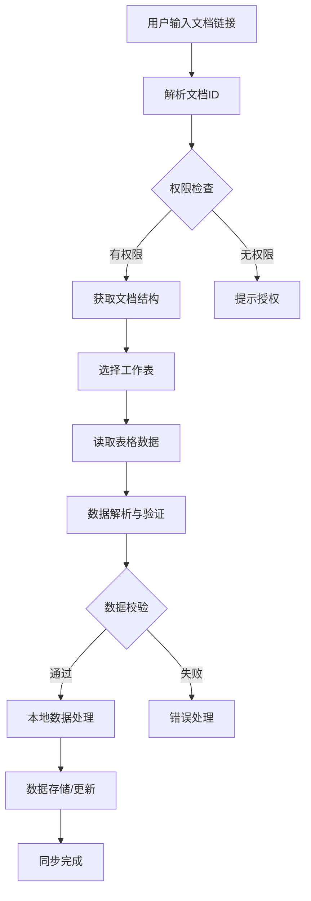

# 腾讯文档集成技术实现方案

**版本**: 1.0
**日期**: 2026-04-26
**相关文件**: PRD.md

---

## 1. 技术方案概述

### 1.1 核心技术选型

| 技术 | 选型 | 版本 | 用途 |
|------|------|------|------|
| 腾讯文档API | 腾讯云API | v3 | 文档读取与写入 |
| 表格解析 | Papa Parse | 5.4.1 | CSV数据解析 |
| 网络请求 | axios | 1.6.0+ | API调用 |
| 数据验证 | Zod | 3.22.0+ | 数据格式验证 |
| 状态管理 | Zustand | 4.4.0+ | 同步状态管理 |
| 本地存储 | SQLite | - | 数据持久化 |

### 1.2 架构设计



---

## 2. 详细实现方案

### 2.1 文档链接解析

**功能**：从用户输入的腾讯文档链接中提取文档ID和工作表ID。

**支持的链接格式**：
- `https://docs.qq.com/sheet/ABCDEFG123456`
- `https://docs.qq.com/sheet/DOC_ID?tab=worksheet_ID`

**解析逻辑**：
```typescript
function parseDocumentUrl(url: string): {
  docId: string;
  sheetId: string;
  type: 'sheet' | 'other';
} {
  const sheetMatch = url.match(/docs\.qq\.com\/sheet\/(\w+)(\?tab=(\w+))?/);
  if (sheetMatch) {
    return {
      docId: sheetMatch[1],
      sheetId: sheetMatch[3] || '0',
      type: 'sheet'
    };
  }
  // 其他类型文档处理...
  return {
    docId: '',
    sheetId: '',
    type: 'other'
  };
}
```

### 2.2 腾讯文档API集成

**认证方式**：
1. **公开文档**：无需认证，直接访问
2. **私有文档**：需要用户授权，获取访问令牌

**API端点**：
- 文档元信息：`GET /v3/documents/{docId}`
- 工作表数据：`GET /v3/sheets/{docId}/{sheetId}/cells`
- 导出表格：`GET /v3/sheets/{docId}/{sheetId}/export`

**请求头**：
```typescript
const headers = {
  'Authorization': `Bearer ${accessToken}`,
  'Content-Type': 'application/json'
};
```

### 2.3 数据解析与验证

**表格结构识别**：
- 自动检测表头行
- 识别关键字段：日期、玩家、积分、场次、赛季
- 支持多种日期格式：`YYYY-MM-DD`、`MM/DD/YYYY`、`YYYY年MM月DD日`

**数据验证规则**：
```typescript
const recordSchema = z.object({
  date: z.string().datetime(),
  player: z.string().min(1),
  score: z.number(),
  session: z.number().optional(),
  season: z.string().optional()
});
```

**解析流程**：
1. 下载CSV数据
2. 使用Papa Parse解析
3. 识别表头并映射字段
4. 验证数据格式
5. 转换为标准格式

### 2.4 数据同步机制

**导入流程**：
1. 读取腾讯文档数据
2. 与本地数据比较
3. 生成差异报告
4. 执行数据合并
5. 保存到本地数据库

**导出流程**：
1. 从本地数据库读取数据
2. 转换为表格格式
3. 上传到腾讯文档
4. 生成更新报告

**冲突处理**：
- 时间戳比较：以最新数据为准
- 手动解决：显示冲突数据，让用户选择
- 日志记录：所有冲突和解决方式都有记录

### 2.5 性能优化

**数据处理**：
- 分批处理：每100行数据处理一次
- 缓存机制：缓存已解析的表格结构
- 并行处理：多工作表同时解析

**网络优化**：
- 压缩传输：启用gzip压缩
- 断点续传：支持大文件分块传输
- 重试机制：网络错误自动重试3次

**用户体验**：
- 进度条：显示同步进度
- 预估时间：根据数据量估算完成时间
- 后台同步：支持后台运行同步任务

---

## 3. 错误处理与安全

### 3.1 错误类型与处理

| 错误类型 | 处理方式 | 重试策略 |
|----------|----------|----------|
| 网络错误 | 显示网络连接失败提示 | 自动重试3次 |
| 权限错误 | 提示用户授权 | 引导用户授权 |
| 数据格式错误 | 显示具体错误位置 | 跳过错误数据 |
| API限制错误 | 显示API配额提示 | 等待后重试 |
| 存储错误 | 显示存储失败提示 | 备份到临时文件 |

### 3.2 安全考虑

**数据安全**：
- 访问令牌本地存储，加密保存
- 不在日志中记录敏感信息
- 数据传输使用HTTPS

**API使用**：
- 遵守腾讯文档API使用规范
- 限制API调用频率
- 缓存API响应，减少请求次数

**用户隐私**：
- 只读取必要的表格数据
- 不存储用户文档的完整内容
- 提供数据访问权限控制

---

## 4. 实现步骤

### 4.1 开发环境准备

1. **安装依赖**：
   ```bash
   pnpm add axios papa-parse zod
   ```

2. **配置API密钥**：
   - 注册腾讯云开发者账号
   - 创建API密钥
   - 配置权限范围

3. **搭建开发环境**：
   - 创建同步模块目录结构
   - 配置环境变量

### 4.2 核心模块实现

1. **文档服务** (`src/services/documents.ts`)：
   - 文档链接解析
   - API调用封装
   - 数据下载与上传

2. **数据解析** (`src/services/parser.ts`)：
   - CSV解析
   - 数据验证
   - 格式转换

3. **同步管理** (`src/services/sync.ts`)：
   - 同步状态管理
   - 冲突处理
   - 进度跟踪

4. **UI组件** (`src/components/sync/`)：
   - 同步配置表单
   - 进度显示
   - 结果报告

### 4.3 测试计划

**单元测试**：
- 文档链接解析
- 数据验证逻辑
- 同步状态管理

**集成测试**：
- 完整同步流程
- 错误处理
- 性能测试

**用户测试**：
- 不同类型文档的兼容性
- 大数据量处理
- 网络不稳定情况

---

## 5. 兼容性与限制

### 5.1 支持的文档类型

| 文档类型 | 支持状态 | 备注 |
|----------|----------|------|
| 腾讯文档表格 | ✅ 完全支持 | 推荐使用 |
| 腾讯文档Excel | ✅ 支持 | 功能有限 |
| 其他腾讯文档 | ⚠️ 部分支持 | 仅支持导出功能 |

### 5.2 数据量限制

| 限制项 | 最大值 | 处理策略 |
|--------|--------|----------|
| 单次同步行数 | 10,000 | 分批处理 |
| 单个文档大小 | 10MB | 分块下载 |
| 同步频率 | 60次/小时 | 频率限制 |

### 5.3 网络要求

- 需要网络连接
- 支持4G/5G/WiFi
- 推荐网络速度：≥1Mbps

---

## 6. 未来扩展

### 6.1 功能扩展

- **自动同步**：定期自动同步数据
- **多文档管理**：支持管理多个腾讯文档
- **模板导入**：提供标准模板下载
- **数据对比**：可视化展示数据差异

### 6.2 技术升级

- **实时协作**：支持多人同时编辑
- **智能识别**：AI辅助表格结构识别
- **离线编辑**：支持离线编辑后同步
- **跨平台同步**：多设备数据同步

---

## 7. 总结

腾讯文档集成功能的实现将为用户提供以下价值：

1. **无缝数据迁移**：快速导入历史数据，避免手动录入
2. **双向数据流通**：本地与在线表数据保持一致
3. **多平台协作**：支持不同设备间的数据共享
4. **数据安全保障**：本地存储为主，在线表作为备份

通过本方案的实施，用户可以轻松实现从传统在线表格到专业德扑积分管理系统的平滑过渡，同时保留与团队成员的协作能力。

---

*方案结束*